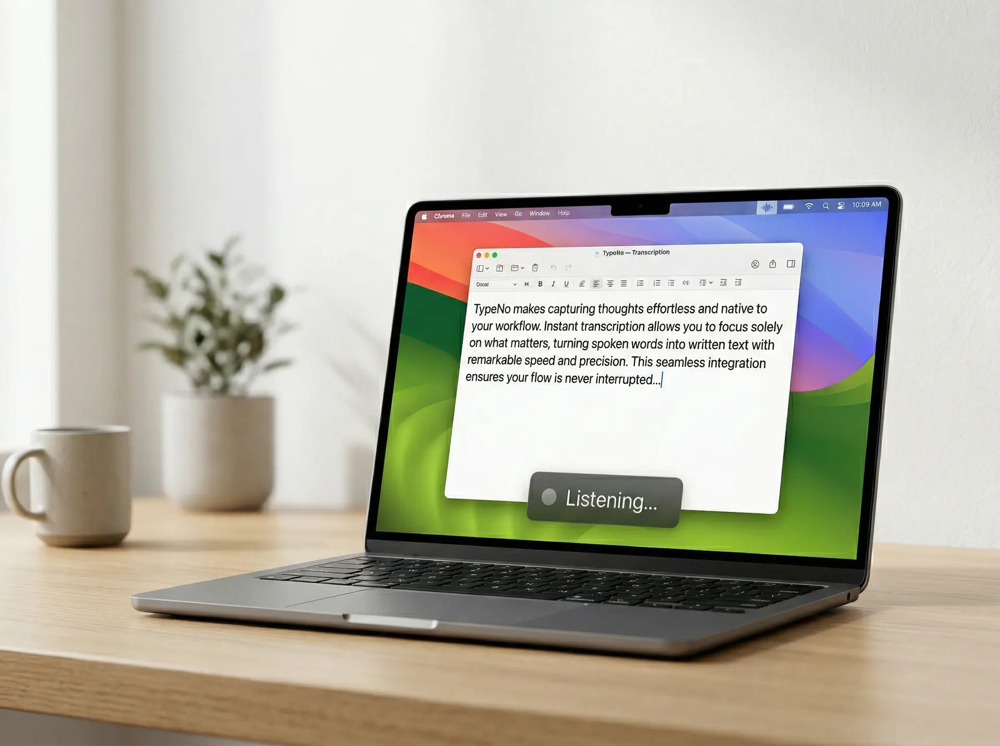

# TypeNo

[English](README.md) | [中文](README_CN.md)

> 無料・オープンソース・プライバシー優先の macOS 音声入力ツール。
> Control を押して、話して、完了。



ミニマルな macOS 音声入力アプリ。TypeNo はあなたの声をキャプチャし、ローカルで文字起こしし、使用中のアプリに自動ペーストします — すべて1秒以内。

公式サイト: [https://typeno.com](https://typeno.com)

ローカル音声認識を支える [marswave ai の coli プロジェクト](https://github.com/marswaveai/coli) に感謝します。

## 使い方

1. **Control を短く押す** と録音開始
2. **もう一度 Control を短く押す** と停止
3. テキストが自動的に文字起こしされ、アクティブなアプリにペーストされます（クリップボードにもコピー）

それだけです。ウィンドウなし、設定なし、アカウント不要。

## インストール

### 方法 1：アプリをダウンロード

- [TypeNo for macOS をダウンロード](https://github.com/marswaveai/TypeNo/releases/latest)
- 最新の `TypeNo.app.zip` をダウンロード
- 解凍して `TypeNo.app` を `/Applications` に移動
- TypeNo を起動

#### macOS がアプリを破損と表示する場合

現在のリリースはまだ Apple の公証を通していないため、macOS がブロックすることがあります。

1. Finder で `TypeNo.app` を右クリックして **開く** を選ぶ
2. **システム設定 → プライバシーとセキュリティ → このまま開く** が表示される場合はそちらを使用
3. それでもブロックされる場合は Terminal で：

```bash
xattr -dr com.apple.quarantine "/Applications/TypeNo.app"
```

### 音声認識エンジンをインストール

TypeNo はローカル音声認識に [coli](https://github.com/marswaveai/coli) を使用します：

```bash
npm install -g @marswave/coli
```

未インストールの場合、アプリ内でガイダンスが表示されます。

### 初回起動

TypeNo には一度だけ次の2つの権限が必要です：
- **マイク** — 音声を録音するため
- **アクセシビリティ** — テキストをアプリに貼り付けるため

初回起動時にアプリが権限付与を案内します。

### 方法 2：ソースからビルド

```bash
git clone https://github.com/marswaveai/TypeNo.git
cd TypeNo
scripts/generate_icon.sh
scripts/build_app.sh
```

アプリは `dist/TypeNo.app` に生成されます。権限を維持するため `/Applications/` に移動してください。

## 操作方法

| 操作 | トリガー |
|---|---|
| 録音の開始/停止 | `Control` を短く押す（300ms以内、他のキーなし） |
| 録音の開始/停止 | メニューバー → Record |
| ファイルの文字起こし | `.m4a`/`.mp3`/`.wav`/`.aac` をメニューバーアイコンにドラッグ |
| アップデート確認 | メニューバー → Check for Updates... |
| 終了 | メニューバー → Quit（`⌘Q`） |

## 設計思想

TypeNo がやることはひとつだけ：音声 → テキスト → ペースト。余計な UI なし、設定なし、構成不要。最速のタイピングは、タイピングしないこと。

## ライセンス

GNU General Public License v3.0
